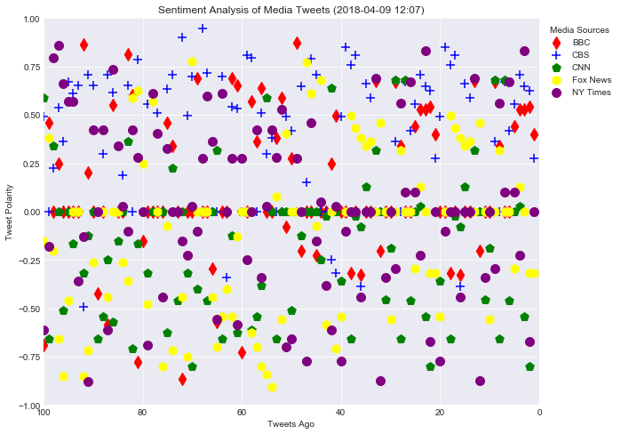

```python
# Dependencies
import tweepy
import numpy as np
import pandas as pd
import seaborn as sns
from datetime import datetime
import matplotlib.pyplot as plt

# Import and Initialize Sentiment Analyzer
from vaderSentiment.vaderSentiment import SentimentIntensityAnalyzer
analyzer = SentimentIntensityAnalyzer()

# Twitter API Keys
from config import (consumer_key, 
                    consumer_secret, 
                    access_token, 
                    access_token_secret)

# Setup Tweepy API Authentication
auth = tweepy.OAuthHandler(consumer_key, consumer_secret)
auth.set_access_token(access_token, access_token_secret)
api = tweepy.API(auth, parser=tweepy.parsers.JSONParser())
```


```python
# Target News Companies
# BBC, CBS, CNN, Fox, and New York times.
target_users = ("@BBC", "@CBS", "@CNN","@FoxNews", "@nytimes")
```


```python
# Variables for holding the tweets of the news companies
bbc_tweets = []
bbc_name = []
bbc_tweets_dates = []
bbc_tweet_count = []

cbs_tweets = []
cbs_name = []
cbs_tweets_dates = []
cbs_tweet_count = []

cnn_tweets = []
cnn_name = []
cnn_tweets_dates = []
cnn_tweet_count = []

fox_tweets = []
fox_name = []
fox_tweets_dates = []
fox_tweet_count = []

nytimes_tweets = []
nytimes_name = []
nytimes_tweets_dates = []
nytimes_tweet_count = []

# Loop through target users
for target_user in target_users:
    
    # Loop through the twitter pages
    for x in range(5):
        public_tweets = api.user_timeline(target_user, page=x)
        
        # Append tweet to correct list
        for y in range(20):
            if target_user == "@BBC":
                news_tweet = public_tweets[y]['text']
                bbc_tweets.append(news_tweet)
                news_tweet_date = public_tweets[y]['created_at']
                bbc_tweets_dates.append(news_tweet_date)
                news_name = public_tweets[y]['user']['name']
                bbc_name.append(news_name)
                bbc_tweet_num = len(bbc_tweets)
                bbc_tweet_count.append(bbc_tweet_num)
                
            elif target_user == "@CBS":
                news_tweet = public_tweets[y]['text']
                cbs_tweets.append(news_tweet)
                news_tweet_date = public_tweets[y]['created_at']
                cbs_tweets_dates.append(news_tweet_date)
                news_name = public_tweets[y]['user']['name']
                cbs_name.append(news_name)
                cbs_tweet_num = len(cbs_tweets)
                cbs_tweet_count.append(cbs_tweet_num)
                
            elif target_user == "@CNN":
                news_tweet = public_tweets[y]['text']
                cnn_tweets.append(news_tweet)
                news_tweet_date = public_tweets[y]['created_at']
                cnn_tweets_dates.append(news_tweet_date)
                news_name = public_tweets[y]['user']['name']
                cnn_name.append(news_name)
                cnn_tweet_num = len(cnn_tweets)
                cnn_tweet_count.append(cnn_tweet_num)
                
            elif target_user == "@FoxNews":
                news_tweet = public_tweets[y]['text']
                fox_tweets.append(news_tweet)
                news_tweet_date = public_tweets[y]['created_at']
                fox_tweets_dates.append(news_tweet_date)
                news_name = public_tweets[y]['user']['name']
                fox_name.append(news_name)
                fox_tweet_num = len(fox_tweets)
                fox_tweet_count.append(fox_tweet_num)
                
            elif target_user == "@nytimes":
                news_tweet = public_tweets[y]['text']
                nytimes_tweets.append(news_tweet)
                news_tweet_date = public_tweets[y]['created_at']
                nytimes_tweets_dates.append(news_tweet_date)
                news_name = public_tweets[y]['user']['name']
                nytimes_name.append(news_name)
                nytimes_tweet_num = len(nytimes_tweets)
                nytimes_tweet_count.append(nytimes_tweet_num)
```


```python
# List of news company's tweets to analyze
company_tweets = [bbc_tweets, cbs_tweets, cnn_tweets, fox_tweets, nytimes_tweets]

# Variables for BBC holding sentiments
bbc_compound_list = []
bbc_positive_list = []
bbc_negative_list = []
bbc_neutral_list = []

# Variables for CBS holding sentiments
cbs_compound_list = []
cbs_positive_list = []
cbs_negative_list = []
cbs_neutral_list = []

# Variables for CNN holding sentiments
cnn_compound_list = []
cnn_positive_list = []
cnn_negative_list = []
cnn_neutral_list = []

# Variables for FoxNews holding sentiments
fox_compound_list = []
fox_positive_list = []
fox_negative_list = []
fox_neutral_list = []

# Variables for NYTimes holding sentiments
nytimes_compound_list = []
nytimes_positive_list = []
nytimes_negative_list = []
nytimes_neutral_list = []

# Loop through the news companies tweets
for company in company_tweets:
    
    if company == bbc_tweets:
        # Run Vader Analysis on each tweet
        for z in range(100):
            results = analyzer.polarity_scores(company[z])
            bbc_comp = results["compound"]
            bbc_pos = results["pos"]
            bbc_neu = results["neu"]
            bbc_neg = results["neg"]
            bbc_compound_list.append(bbc_comp)
            bbc_positive_list.append(bbc_pos)
            bbc_negative_list.append(bbc_neg)
            bbc_neutral_list.append(bbc_neu)
    
    elif company == cbs_tweets:
        # Run Vader Analysis on each tweet
        for z in range(100):
            results = analyzer.polarity_scores(company[z])
            cbs_comp = results["compound"]
            cbs_pos = results["pos"]
            cbs_neu = results["neu"]
            cbs_neg = results["neg"]
            cbs_compound_list.append(cbs_comp)
            cbs_positive_list.append(cbs_pos)
            cbs_negative_list.append(cbs_neg)
            cbs_neutral_list.append(cbs_neu)
            
    elif company == cnn_tweets:
        # Run Vader Analysis on each tweet
        for z in range(100):
            results = analyzer.polarity_scores(company[z])
            cnn_comp = results["compound"]
            cnn_pos = results["pos"]
            cnn_neu = results["neu"]
            cnn_neg = results["neg"]
            cnn_compound_list.append(cnn_comp)
            cnn_positive_list.append(cnn_pos)
            cnn_negative_list.append(cnn_neg)
            cnn_neutral_list.append(cnn_neu)
            
    elif company == fox_tweets:
        # Run Vader Analysis on each tweet
        for z in range(100):
            results = analyzer.polarity_scores(company[z])
            fox_comp = results["compound"]
            fox_pos = results["pos"]
            fox_neu = results["neu"]
            fox_neg = results["neg"]
            fox_compound_list.append(fox_comp)
            fox_positive_list.append(fox_pos)
            fox_negative_list.append(fox_neg)
            fox_neutral_list.append(fox_neu)
            
    elif company == nytimes_tweets:
        # Run Vader Analysis on each tweet
        for z in range(100):
            results = analyzer.polarity_scores(company[z])
            nytimes_comp = results["compound"]
            nytimes_pos = results["pos"]
            nytimes_neu = results["neu"]
            nytimes_neg = results["neg"]
            nytimes_compound_list.append(nytimes_comp)
            nytimes_positive_list.append(nytimes_pos)
            nytimes_negative_list.append(nytimes_neg)
            nytimes_neutral_list.append(nytimes_neu)
```


```python
# Creating BBC DataFrame
bbc_tweets_df = pd.DataFrame(bbc_tweets)
renamed_bbc_tweets_df = bbc_tweets_df.rename(columns={0 : 'Tweets'})

bbc_name_df = pd.DataFrame(bbc_name)
renamed_bbc_name_df = bbc_name_df.rename(columns={0 : 'Name'})

bbc_tweets_dates_df = pd.DataFrame(bbc_tweets_dates)
renamed_bbc_tweets_dates_df = bbc_tweets_dates_df.rename(columns={0 : 'Dates'})

bbc_compound_list_df = pd.DataFrame(bbc_compound_list)
renamed_bbc_compound_list_df = bbc_compound_list_df.rename(columns={0 : 'Compound Score'})

bbc_positive_list_df = pd.DataFrame(bbc_positive_list)
renamed_bbc_positive_list_df = bbc_positive_list_df.rename(columns={0 : 'Positive Score'})

bbc_negative_list_df = pd.DataFrame(bbc_negative_list) 
renamed_bbc_negative_list_df = bbc_negative_list_df.rename(columns={0 : 'Negative Score'})

bbc_neutral_list_df = pd.DataFrame(bbc_neutral_list)
renamed_bbc_neutral_list_df = bbc_neutral_list_df.rename(columns={0 : 'Neutral Score'})

bbc_tweet_count_df = pd.DataFrame(bbc_tweet_count)
renamed_bbc_tweet_count_df = bbc_tweet_count_df.rename(columns={0 : 'Tweet Count'})
```


```python
# Joining BBC DataFrames
first_join_bbc = renamed_bbc_name_df.join(renamed_bbc_tweets_df)
second_join_bbc = first_join_bbc.join(renamed_bbc_tweets_dates_df)
third_join_bbc = second_join_bbc.join(renamed_bbc_compound_list_df)
fourth_join_bbc = third_join_bbc.join(renamed_bbc_positive_list_df)
fifth_join_bbc = fourth_join_bbc.join(renamed_bbc_negative_list_df)
sixth_join_bbc = fifth_join_bbc.join(renamed_bbc_neutral_list_df)
bbc_df = sixth_join_bbc.join(renamed_bbc_tweet_count_df)
bbc_df.head()
```


<div>
<style scoped>
    .dataframe tbody tr th:only-of-type {
        vertical-align: middle;
    }

    .dataframe tbody tr th {
        vertical-align: top;
    }

    .dataframe thead th {
        text-align: right;
    }
</style>
<table border="1" class="dataframe">
  <thead>
    <tr style="text-align: right;">
      <th></th>
      <th>Name</th>
      <th>Tweets</th>
      <th>Dates</th>
      <th>Compound Score</th>
      <th>Positive Score</th>
      <th>Negative Score</th>
      <th>Neutral Score</th>
      <th>Tweet Count</th>
    </tr>
  </thead>
  <tbody>
    <tr>
      <th>0</th>
      <td>BBC</td>
      <td>RT @BBCTheOneShow: Tonight on The One Show - @...</td>
      <td>Mon Apr 09 15:42:30 +0000 2018</td>
      <td>0.4003</td>
      <td>0.144</td>
      <td>0.0</td>
      <td>0.856</td>
      <td>1</td>
    </tr>
    <tr>
      <th>1</th>
      <td>BBC</td>
      <td>RT @BBCSport: What a way to save match point!\...</td>
      <td>Mon Apr 09 15:29:26 +0000 2018</td>
      <td>0.5411</td>
      <td>0.189</td>
      <td>0.0</td>
      <td>0.811</td>
      <td>2</td>
    </tr>
    <tr>
      <th>2</th>
      <td>BBC</td>
      <td>🐶❤️😽\nHenry and Baloo: Dog and cat travel comp...</td>
      <td>Mon Apr 09 15:07:08 +0000 2018</td>
      <td>0.5267</td>
      <td>0.207</td>
      <td>0.0</td>
      <td>0.793</td>
      <td>3</td>
    </tr>
    <tr>
      <th>3</th>
      <td>BBC</td>
      <td>A new campaign is encouraging people to do CPR...</td>
      <td>Mon Apr 09 14:02:03 +0000 2018</td>
      <td>0.5267</td>
      <td>0.145</td>
      <td>0.0</td>
      <td>0.855</td>
      <td>4</td>
    </tr>
    <tr>
      <th>4</th>
      <td>BBC</td>
      <td>How NOT to impress Madonna...\n#TheGrahamNorto...</td>
      <td>Mon Apr 09 13:01:05 +0000 2018</td>
      <td>0.4404</td>
      <td>0.293</td>
      <td>0.0</td>
      <td>0.707</td>
      <td>5</td>
    </tr>
  </tbody>
</table>
</div>


```python
bbc_df.to_csv('BBC_Twitter_Sentiments.csv')
```


```python
# Creating CBS DataFrame
cbs_tweets_df = pd.DataFrame(cbs_tweets)
renamed_cbs_tweets_df = cbs_tweets_df.rename(columns={0 : 'Tweets'})

cbs_name_df = pd.DataFrame(cbs_name)
renamed_cbs_name_df = cbs_name_df.rename(columns={0 : 'Name'})

cbs_tweets_dates_df = pd.DataFrame(cbs_tweets_dates)
renamed_cbs_tweets_dates_df = cbs_tweets_dates_df.rename(columns={0 : 'Dates'})

cbs_compound_list_df = pd.DataFrame(cbs_compound_list)
renamed_cbs_compound_list_df = cbs_compound_list_df.rename(columns={0 : 'Compound Score'})

cbs_positive_list_df = pd.DataFrame(cbs_positive_list)
renamed_cbs_positive_list_df = cbs_positive_list_df.rename(columns={0 : 'Positive Score'})

cbs_negative_list_df = pd.DataFrame(cbs_negative_list) 
renamed_cbs_negative_list_df = cbs_negative_list_df.rename(columns={0 : 'Negative Score'})

cbs_neutral_list_df = pd.DataFrame(cbs_neutral_list)
renamed_cbs_neutral_list_df = cbs_neutral_list_df.rename(columns={0 : 'Neutral Score'})

cbs_tweet_count_df = pd.DataFrame(cbs_tweet_count)
renamed_cbs_tweet_count_df = cbs_tweet_count_df.rename(columns={0 : 'Tweet Count'})
```


```python
# Joining CBS DataFrames
first_join_cbs = renamed_cbs_name_df.join(renamed_cbs_tweets_df)
second_join_cbs = first_join_cbs.join(renamed_cbs_tweets_dates_df)
third_join_cbs = second_join_cbs.join(renamed_cbs_compound_list_df)
fourth_join_cbs = third_join_cbs.join(renamed_cbs_positive_list_df)
fifth_join_cbs = fourth_join_cbs.join(renamed_cbs_negative_list_df)
sixth_join_cbs = fifth_join_cbs.join(renamed_cbs_neutral_list_df)
cbs_df = sixth_join_cbs.join(renamed_cbs_tweet_count_df)
cbs_df.head()
```


<div>
<style scoped>
    .dataframe tbody tr th:only-of-type {
        vertical-align: middle;
    }

    .dataframe tbody tr th {
        vertical-align: top;
    }

    .dataframe thead th {
        text-align: right;
    }
</style>
<table border="1" class="dataframe">
  <thead>
    <tr style="text-align: right;">
      <th></th>
      <th>Name</th>
      <th>Tweets</th>
      <th>Dates</th>
      <th>Compound Score</th>
      <th>Positive Score</th>
      <th>Negative Score</th>
      <th>Neutral Score</th>
      <th>Tweet Count</th>
    </tr>
  </thead>
  <tbody>
    <tr>
      <th>0</th>
      <td>CBS</td>
      <td>Which state does @reba call home and which son...</td>
      <td>Mon Apr 09 15:00:00 +0000 2018</td>
      <td>0.2732</td>
      <td>0.129</td>
      <td>0.086</td>
      <td>0.784</td>
      <td>1</td>
    </tr>
    <tr>
      <th>1</th>
      <td>CBS</td>
      <td>This just in! Thirteen-time ACM Award® winner ...</td>
      <td>Mon Apr 09 13:36:00 +0000 2018</td>
      <td>0.6239</td>
      <td>0.214</td>
      <td>0.000</td>
      <td>0.786</td>
      <td>2</td>
    </tr>
    <tr>
      <th>2</th>
      <td>CBS</td>
      <td>It's time to celebrate! @MomCBS will be back f...</td>
      <td>Mon Apr 09 01:42:06 +0000 2018</td>
      <td>0.6467</td>
      <td>0.280</td>
      <td>0.000</td>
      <td>0.720</td>
      <td>3</td>
    </tr>
    <tr>
      <th>3</th>
      <td>CBS</td>
      <td>@OldDominion's Matthew Ramsey is here with a f...</td>
      <td>Sun Apr 08 22:00:01 +0000 2018</td>
      <td>0.7096</td>
      <td>0.258</td>
      <td>0.000</td>
      <td>0.742</td>
      <td>4</td>
    </tr>
    <tr>
      <th>4</th>
      <td>CBS</td>
      <td>It all comes down to this! Stream Round 4 of #...</td>
      <td>Sun Apr 08 18:38:13 +0000 2018</td>
      <td>0.5562</td>
      <td>0.146</td>
      <td>0.000</td>
      <td>0.854</td>
      <td>5</td>
    </tr>
  </tbody>
</table>
</div>


```python
cbs_df.to_csv('CBS_Twitter_Sentiments.csv')
```


```python
# Creating CNN DataFrame
cnn_tweets_df = pd.DataFrame(cnn_tweets)
renamed_cnn_tweets_df = cnn_tweets_df.rename(columns={0 : 'Tweets'})

cnn_name_df = pd.DataFrame(cnn_name)
renamed_cnn_name_df = cnn_name_df.rename(columns={0 : 'Name'})

cnn_tweets_dates_df = pd.DataFrame(cnn_tweets_dates)
renamed_cnn_tweets_dates_df = cnn_tweets_dates_df.rename(columns={0 : 'Dates'})

cnn_compound_list_df = pd.DataFrame(cnn_compound_list)
renamed_cnn_compound_list_df = cnn_compound_list_df.rename(columns={0 : 'Compound Score'})

cnn_positive_list_df = pd.DataFrame(cnn_positive_list)
renamed_cnn_positive_list_df = cnn_positive_list_df.rename(columns={0 : 'Positive Score'})

cnn_negative_list_df = pd.DataFrame(cnn_negative_list) 
renamed_cnn_negative_list_df = cnn_negative_list_df.rename(columns={0 : 'Negative Score'})

cnn_neutral_list_df = pd.DataFrame(cnn_neutral_list)
renamed_cnn_neutral_list_df = cnn_neutral_list_df.rename(columns={0 : 'Neutral Score'})

cnn_tweet_count_df = pd.DataFrame(cnn_tweet_count)
renamed_cnn_tweet_count_df = cnn_tweet_count_df.rename(columns={0 : 'Tweet Count'})
```


```python
# Joining CNN DataFrames
first_join_cnn = renamed_cnn_name_df.join(renamed_cnn_tweets_df)
second_join_cnn = first_join_cnn.join(renamed_cnn_tweets_dates_df)
third_join_cnn = second_join_cnn.join(renamed_cnn_compound_list_df)
fourth_join_cnn = third_join_cnn.join(renamed_cnn_positive_list_df)
fifth_join_cnn = fourth_join_cnn.join(renamed_cnn_negative_list_df)
sixth_join_cnn = fifth_join_cnn.join(renamed_cnn_neutral_list_df)
cnn_df = sixth_join_cnn.join(renamed_cnn_tweet_count_df)
cnn_df.head()
```


<div>
<style scoped>
    .dataframe tbody tr th:only-of-type {
        vertical-align: middle;
    }

    .dataframe tbody tr th {
        vertical-align: top;
    }

    .dataframe thead th {
        text-align: right;
    }
</style>
<table border="1" class="dataframe">
  <thead>
    <tr style="text-align: right;">
      <th></th>
      <th>Name</th>
      <th>Tweets</th>
      <th>Dates</th>
      <th>Compound Score</th>
      <th>Positive Score</th>
      <th>Negative Score</th>
      <th>Neutral Score</th>
      <th>Tweet Count</th>
    </tr>
  </thead>
  <tbody>
    <tr>
      <th>0</th>
      <td>CNN</td>
      <td>Facebook CEO Mark Zuckerberg is on Capitol Hil...</td>
      <td>Mon Apr 09 15:51:28 +0000 2018</td>
      <td>0.0000</td>
      <td>0.000</td>
      <td>0.000</td>
      <td>1.000</td>
      <td>1</td>
    </tr>
    <tr>
      <th>1</th>
      <td>CNN</td>
      <td>Sean Hannity, who mocked Michelle Obama, says ...</td>
      <td>Mon Apr 09 15:50:06 +0000 2018</td>
      <td>-0.8020</td>
      <td>0.000</td>
      <td>0.387</td>
      <td>0.613</td>
      <td>2</td>
    </tr>
    <tr>
      <th>2</th>
      <td>CNN</td>
      <td>Oklahoma teachers continue their walkout for a...</td>
      <td>Mon Apr 09 15:40:08 +0000 2018</td>
      <td>-0.5423</td>
      <td>0.000</td>
      <td>0.231</td>
      <td>0.769</td>
      <td>3</td>
    </tr>
    <tr>
      <th>3</th>
      <td>CNN</td>
      <td>Rick Scott is the toughest challenger Bill Nel...</td>
      <td>Mon Apr 09 15:30:10 +0000 2018</td>
      <td>0.0258</td>
      <td>0.064</td>
      <td>0.059</td>
      <td>0.876</td>
      <td>4</td>
    </tr>
    <tr>
      <th>4</th>
      <td>CNN</td>
      <td>What cities and states are doing about guns si...</td>
      <td>Mon Apr 09 15:20:12 +0000 2018</td>
      <td>0.0000</td>
      <td>0.000</td>
      <td>0.000</td>
      <td>1.000</td>
      <td>5</td>
    </tr>
  </tbody>
</table>
</div>


```python
cnn_df.to_csv('CNN_Twitter_Sentiments.csv')
```


```python
# Creating FoxNews DataFrame
fox_tweets_df = pd.DataFrame(fox_tweets)
renamed_fox_tweets_df = fox_tweets_df.rename(columns={0 : 'Tweets'})

fox_name_df = pd.DataFrame(fox_name)
renamed_fox_name_df = fox_name_df.rename(columns={0 : 'Name'})

fox_tweets_dates_df = pd.DataFrame(fox_tweets_dates)
renamed_fox_tweets_dates_df = fox_tweets_dates_df.rename(columns={0 : 'Dates'})

fox_compound_list_df = pd.DataFrame(fox_compound_list)
renamed_fox_compound_list_df = fox_compound_list_df.rename(columns={0 : 'Compound Score'})

fox_positive_list_df = pd.DataFrame(fox_positive_list)
renamed_fox_positive_list_df = fox_positive_list_df.rename(columns={0 : 'Positive Score'})

fox_negative_list_df = pd.DataFrame(fox_negative_list) 
renamed_fox_negative_list_df = fox_negative_list_df.rename(columns={0 : 'Negative Score'})

fox_neutral_list_df = pd.DataFrame(fox_neutral_list)
renamed_fox_neutral_list_df = fox_neutral_list_df.rename(columns={0 : 'Neutral Score'})

fox_tweet_count_df = pd.DataFrame(fox_tweet_count)
renamed_fox_tweet_count_df = fox_tweet_count_df.rename(columns={0 : 'Tweet Count'})
```


```python
# Joining FoxNews DataFrames
first_join_fox = renamed_fox_name_df.join(renamed_fox_tweets_df)
second_join_fox = first_join_fox.join(renamed_fox_tweets_dates_df)
third_join_fox = second_join_fox.join(renamed_fox_compound_list_df)
fourth_join_fox = third_join_fox.join(renamed_fox_positive_list_df)
fifth_join_fox = fourth_join_fox.join(renamed_fox_negative_list_df)
sixth_join_fox = fifth_join_fox.join(renamed_fox_neutral_list_df)
fox_df = sixth_join_fox.join(renamed_fox_tweet_count_df)
fox_df.head()
```


<div>
<style scoped>
    .dataframe tbody tr th:only-of-type {
        vertical-align: middle;
    }

    .dataframe tbody tr th {
        vertical-align: top;
    }

    .dataframe thead th {
        text-align: right;
    }
</style>
<table border="1" class="dataframe">
  <thead>
    <tr style="text-align: right;">
      <th></th>
      <th>Name</th>
      <th>Tweets</th>
      <th>Dates</th>
      <th>Compound Score</th>
      <th>Positive Score</th>
      <th>Negative Score</th>
      <th>Neutral Score</th>
      <th>Tweet Count</th>
    </tr>
  </thead>
  <tbody>
    <tr>
      <th>0</th>
      <td>Fox News</td>
      <td>.@Richardafowler on escalating trade tension b...</td>
      <td>Mon Apr 09 15:48:51 +0000 2018</td>
      <td>-0.3182</td>
      <td>0.00</td>
      <td>0.187</td>
      <td>0.813</td>
      <td>1</td>
    </tr>
    <tr>
      <th>1</th>
      <td>Fox News</td>
      <td>Alex Conant: “Everyone loses in a trade war.” ...</td>
      <td>Mon Apr 09 15:41:12 +0000 2018</td>
      <td>-0.3182</td>
      <td>0.00</td>
      <td>0.247</td>
      <td>0.753</td>
      <td>2</td>
    </tr>
    <tr>
      <th>2</th>
      <td>Fox News</td>
      <td>RT @FoxBusiness: Dow at session highs: https:/...</td>
      <td>Mon Apr 09 15:30:54 +0000 2018</td>
      <td>0.0000</td>
      <td>0.00</td>
      <td>0.000</td>
      <td>1.000</td>
      <td>3</td>
    </tr>
    <tr>
      <th>3</th>
      <td>Fox News</td>
      <td>'Shirtless' daredevil draped in American flag ...</td>
      <td>Mon Apr 09 15:20:42 +0000 2018</td>
      <td>0.1280</td>
      <td>0.12</td>
      <td>0.000</td>
      <td>0.880</td>
      <td>4</td>
    </tr>
    <tr>
      <th>4</th>
      <td>Fox News</td>
      <td>Breaking News: Body of Tennessee double-murder...</td>
      <td>Mon Apr 09 15:06:25 +0000 2018</td>
      <td>-0.2960</td>
      <td>0.00</td>
      <td>0.145</td>
      <td>0.855</td>
      <td>5</td>
    </tr>
  </tbody>
</table>
</div>


```python
fox_df.to_csv('Fox_Twitter_Sentiments.csv')
```


```python
# Creating NYTimes DataFrame
nytimes_tweets_df = pd.DataFrame(nytimes_tweets)
renamed_nytimes_tweets_df = nytimes_tweets_df.rename(columns={0 : 'Tweets'})

nytimes_name_df = pd.DataFrame(nytimes_name)
renamed_nytimes_name_df = nytimes_name_df.rename(columns={0 : 'Name'})

nytimes_tweets_dates_df = pd.DataFrame(nytimes_tweets_dates)
renamed_nytimes_tweets_dates_df = nytimes_tweets_dates_df.rename(columns={0 : 'Dates'})

nytimes_compound_list_df = pd.DataFrame(nytimes_compound_list)
renamed_nytimes_compound_list_df = nytimes_compound_list_df.rename(columns={0 : 'Compound Score'})

nytimes_positive_list_df = pd.DataFrame(nytimes_positive_list)
renamed_nytimes_positive_list_df = nytimes_positive_list_df.rename(columns={0 : 'Positive Score'})

nytimes_negative_list_df = pd.DataFrame(nytimes_negative_list) 
renamed_nytimes_negative_list_df = nytimes_negative_list_df.rename(columns={0 : 'Negative Score'})

nytimes_neutral_list_df = pd.DataFrame(nytimes_neutral_list)
renamed_nytimes_neutral_list_df = nytimes_neutral_list_df.rename(columns={0 : 'Neutral Score'})

nytimes_tweet_count_df = pd.DataFrame(nytimes_tweet_count)
renamed_nytimes_tweet_count_df = nytimes_tweet_count_df.rename(columns={0 : 'Tweet Count'})
```


```python
# Joining NYTimes DataFrames
first_join_nytimes = renamed_nytimes_name_df.join(renamed_nytimes_tweets_df)
second_join_nytimes = first_join_nytimes.join(renamed_nytimes_tweets_dates_df)
third_join_nytimes = second_join_nytimes.join(renamed_nytimes_compound_list_df)
fourth_join_nytimes = third_join_nytimes.join(renamed_nytimes_positive_list_df)
fifth_join_nytimes = fourth_join_nytimes.join(renamed_nytimes_negative_list_df)
sixth_join_nytimes = fifth_join_nytimes.join(renamed_nytimes_neutral_list_df)
nytimes_df = sixth_join_nytimes.join(renamed_nytimes_tweet_count_df)
nytimes_df.head()
```


<div>
<style scoped>
    .dataframe tbody tr th:only-of-type {
        vertical-align: middle;
    }

    .dataframe tbody tr th {
        vertical-align: top;
    }

    .dataframe thead th {
        text-align: right;
    }
</style>
<table border="1" class="dataframe">
  <thead>
    <tr style="text-align: right;">
      <th></th>
      <th>Name</th>
      <th>Tweets</th>
      <th>Dates</th>
      <th>Compound Score</th>
      <th>Positive Score</th>
      <th>Negative Score</th>
      <th>Neutral Score</th>
      <th>Tweet Count</th>
    </tr>
  </thead>
  <tbody>
    <tr>
      <th>0</th>
      <td>The New York Times</td>
      <td>The signature may be going out of style https:...</td>
      <td>Mon Apr 09 15:50:05 +0000 2018</td>
      <td>0.0000</td>
      <td>0.000</td>
      <td>0.000</td>
      <td>1.000</td>
      <td>1</td>
    </tr>
    <tr>
      <th>1</th>
      <td>The New York Times</td>
      <td>The leader of ISIS in northern Afghanistan has...</td>
      <td>Mon Apr 09 15:40:08 +0000 2018</td>
      <td>-0.6705</td>
      <td>0.000</td>
      <td>0.243</td>
      <td>0.757</td>
      <td>2</td>
    </tr>
    <tr>
      <th>2</th>
      <td>The New York Times</td>
      <td>RT @TimHerrera: Giving feedback isn’t easy! Bu...</td>
      <td>Mon Apr 09 15:30:09 +0000 2018</td>
      <td>0.8326</td>
      <td>0.328</td>
      <td>0.056</td>
      <td>0.617</td>
      <td>3</td>
    </tr>
    <tr>
      <th>3</th>
      <td>The New York Times</td>
      <td>Gov. Rick Scott made official what Floridians ...</td>
      <td>Mon Apr 09 15:20:10 +0000 2018</td>
      <td>-0.2263</td>
      <td>0.000</td>
      <td>0.101</td>
      <td>0.899</td>
      <td>4</td>
    </tr>
    <tr>
      <th>4</th>
      <td>The New York Times</td>
      <td>The federal government’s top ethics official s...</td>
      <td>Mon Apr 09 15:10:05 +0000 2018</td>
      <td>0.1027</td>
      <td>0.094</td>
      <td>0.073</td>
      <td>0.833</td>
      <td>5</td>
    </tr>
  </tbody>
</table>
</div>


```python
nytimes_df.to_csv('NYTimes_Twitter_Sentiments.csv')
```


```python
# Media Sources Scatter Plot
fig, ax = plt.subplots(figsize = (10,8))

x_bbc = bbc_df['Tweet Count']
y_bbc = bbc_df['Compound Score']

x_cbs = bbc_df['Tweet Count']
y_cbs = cbs_df['Compound Score']

x_cnn = cnn_df['Tweet Count']
y_cnn = cnn_df['Compound Score']

x_fox = fox_df['Tweet Count']
y_fox = fox_df['Compound Score']

x_nytimes = nytimes_df['Tweet Count']
y_nytimes = nytimes_df['Compound Score']

# Formatting Variables

# Create Scatter Plot
plt.scatter(x=x_bbc, y=y_bbc, c='red', s=100, marker='d', label='BBC')
plt.scatter(x=x_cbs, y=y_cbs, c='blue', s=100, marker='+', label='CBS')
plt.scatter(x=x_cnn, y=y_cnn, c='green', s=100, marker='p', label='CNN')
plt.scatter(x=x_fox, y=y_fox, c='yellow', s=100, marker='h', label='Fox News')
plt.scatter(x=x_nytimes, y=y_nytimes, c='purple', s=100, marker='o', label='NY Times')

# Format Scatter Plot
plt.xlim(100, 0)
plt.ylim(-1, 1)
plt.xlabel('Tweets Ago')
plt.ylabel('Tweet Polarity')
now = datetime.now()
now = now.strftime("%Y-%m-%d %H:%M")
plt.title(f'Sentiment Analysis of Media Tweets ({now})')
plt.legend(title='Media Sources',bbox_to_anchor=(1, 1), loc=2)
sns.set_style('darkgrid')
plt.savefig(f'Sentiment Analysis of Media Tweets ({now})')
```





```python
# Bar Chart : X-Axis
media_outlets = ['BBC', 'CBS', 'CNN', 'Fox News', 'NY Times']
```


```python
# Bar Chart : Y-Axis
overall_sentiment_bbc = bbc_df['Compound Score'].mean()
overall_sentiment_cbs = cbs_df['Compound Score'].mean()
overall_sentiment_cnn = cnn_df['Compound Score'].mean()
overall_sentiment_fox = fox_df['Compound Score'].mean()
overall_sentiment_nytimes = nytimes_df['Compound Score'].mean()

y_axis = [overall_sentiment_bbc, overall_sentiment_cbs, overall_sentiment_cnn,
          overall_sentiment_fox, overall_sentiment_nytimes]
```


```python
# Create Bar Chart
sns.barplot(x=media_outlets, y=y_axis)
sns.set_style("darkgrid")

now = datetime.now()
now = now.strftime("%Y-%m-%d %H:%M")
plt.xlabel('Media Outlets')
plt.ylabel('Tweet Polarity')
plt.title(f'Overall Sentiment based on Twitter ({now})')
plt.savefig(f'Overall Sentiment based on Twitter ({now})')
```


```python
# Display more statistics about Twitter Sentiment
media_outlets_df = pd.DataFrame({'BBC' : bbc_df['Compound Score'],
                                 'CBS' : cbs_df['Compound Score'],
                                 'CNN' : cnn_df['Compound Score'],
                                 'Fox News' : fox_df['Compound Score'],
                                 'NY Times' : nytimes_df['Compound Score']})
```


```python
media_outlets_df.describe()
```


<div>
<style scoped>
    .dataframe tbody tr th:only-of-type {
        vertical-align: middle;
    }

    .dataframe tbody tr th {
        vertical-align: top;
    }

    .dataframe thead th {
        text-align: right;
    }
</style>
<table border="1" class="dataframe">
  <thead>
    <tr style="text-align: right;">
      <th></th>
      <th>BBC</th>
      <th>CBS</th>
      <th>CNN</th>
      <th>Fox News</th>
      <th>NY Times</th>
    </tr>
  </thead>
  <tbody>
    <tr>
      <th>count</th>
      <td>100.000000</td>
      <td>100.000000</td>
      <td>100.000000</td>
      <td>100.000000</td>
      <td>100.000000</td>
    </tr>
    <tr>
      <th>mean</th>
      <td>0.119560</td>
      <td>0.367422</td>
      <td>-0.144693</td>
      <td>-0.095427</td>
      <td>0.013175</td>
    </tr>
    <tr>
      <th>std</th>
      <td>0.369481</td>
      <td>0.353212</td>
      <td>0.363008</td>
      <td>0.421776</td>
      <td>0.452307</td>
    </tr>
    <tr>
      <th>min</th>
      <td>-0.865800</td>
      <td>-0.493900</td>
      <td>-0.802000</td>
      <td>-0.906200</td>
      <td>-0.877900</td>
    </tr>
    <tr>
      <th>25%</th>
      <td>0.000000</td>
      <td>0.000000</td>
      <td>-0.458800</td>
      <td>-0.440400</td>
      <td>-0.296000</td>
    </tr>
    <tr>
      <th>50%</th>
      <td>0.000000</td>
      <td>0.492600</td>
      <td>-0.013800</td>
      <td>0.000000</td>
      <td>0.000000</td>
    </tr>
    <tr>
      <th>75%</th>
      <td>0.440400</td>
      <td>0.659700</td>
      <td>0.000000</td>
      <td>0.128000</td>
      <td>0.371375</td>
    </tr>
    <tr>
      <th>max</th>
      <td>0.875000</td>
      <td>0.945100</td>
      <td>0.680800</td>
      <td>0.778300</td>
      <td>0.859100</td>
    </tr>
  </tbody>
</table>
</div>


