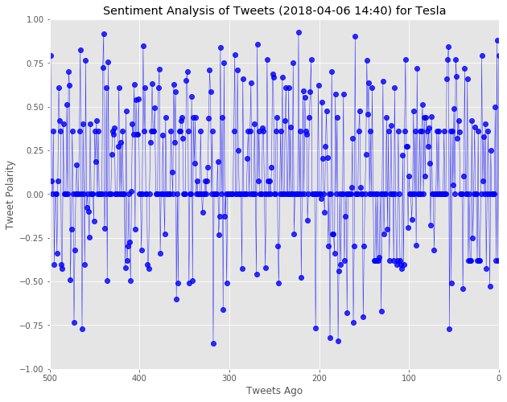
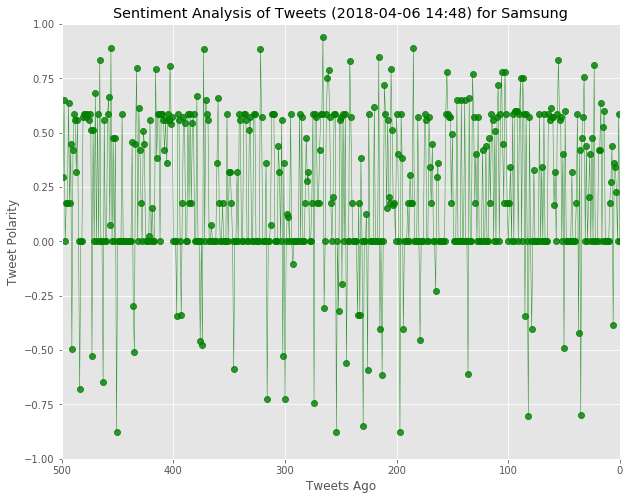

```python
# Dependencies
import tweepy
import numpy as np
import pandas as pd
import numpy as np
import seaborn as sns
from datetime import datetime
import matplotlib.pyplot as plt
from matplotlib import style
style.use('ggplot')

# Import and Initialize Sentiment Analyzer
from vaderSentiment.vaderSentiment import SentimentIntensityAnalyzer
analyzer = SentimentIntensityAnalyzer()

# Twitter API Keys
from twitter_keys import (consumer_key, 
                    consumer_secret, 
                    access_token, 
                    access_token_secret)

# Setup Tweepy API Authentication
auth = tweepy.OAuthHandler(consumer_key, consumer_secret)
auth.set_access_token(access_token, access_token_secret)
api = tweepy.API(auth, wait_on_rate_limit=True, parser=tweepy.parsers.JSONParser())

## Search Terms
#--Tesla
#--Samsung
#--Nike

# HELP
#Stu_Plot_Sentiments_solved
#Ins_Tweets_With_Filter
```


```python
# Create a Search Term
first_search_term = 'Tesla'

# Counter
counter = 0

# Create variable for holding the oldest tweet
oldest_tweet = None

# List to hold unique IDs
tesla_unique_ids = []

# Create a list to catch all the tweets
tesla_tweet_list = []

# Add 'Real Person' Filter
min_tweets = 5
max_tweets = 10000
max_followers = 2500
max_following = 2500
lang = "en"

# Variables for holding sentiments
tesla_sentiments = []

# Start Procress of Retrieving tweets
if counter < 500:

    # Loop through
    for x in range(20):
        
        # Retrive tweets
        public_tweets = api.search(first_search_term, count=100,
                                   result_type="recent", 
                                   max_id=oldest_tweet)
    
        # Retrieve Tweets
        for tweet in public_tweets["statuses"]:
        
            tweet_id = tweet["id"]
        
            # Filter out duplicates
            if tweet_id not in tesla_unique_ids:
            
                tesla_unique_ids.append(tweet_id)
            
                # Try to get only 500 tweets
                if len(tesla_tweet_list) > 499:
                    break
            
                    # Use 'real person' filter
                elif (tweet["user"]["followers_count"] < max_followers and
                    tweet["user"]["statuses_count"] > min_tweets and
                    tweet["user"]["statuses_count"] < max_tweets and
                    tweet["user"]["friends_count"] < max_following and
                    tweet["user"]["lang"] == lang):

                    tesla_tweet_list.append(tweet["text"])
            
                    # Run Tweets through VADER Analysis
                    results = analyzer.polarity_scores(tweet["text"])
                    comp_tesla = results["compound"]
                    pos_tesla = results["pos"]
                    neu_tesla = results["neu"]
                    neg_tesla = results["neg"]
                    tweets_ago = counter
            
                    # Add sentiments for each tweet into a list
                    tesla_sentiments.append({"Date": tweet["created_at"], 
                                    "Compound": comp_tesla,
                                    "Positive": pos_tesla,
                                    "Negative": neu_tesla,
                                    "Neutral": neg_tesla,
                                    "Tweets Ago": counter})
        
                    # Add to counter 
                    counter += 1
                
                    # Reset oldest_tweet
                    oldest_tweet = tweet_id - 1
```


```python
len(tesla_tweet_list)
```


    500


```python
# Convert sentiments to DataFrame
tesla_sentiments_df = pd.DataFrame.from_dict(tesla_sentiments)
tesla_sentiments_df.head()
```


<div>
<style scoped>
    .dataframe tbody tr th:only-of-type {
        vertical-align: middle;
    }

    .dataframe tbody tr th {
        vertical-align: top;
    }

    .dataframe thead th {
        text-align: right;
    }
</style>
<table border="1" class="dataframe">
  <thead>
    <tr style="text-align: right;">
      <th></th>
      <th>Compound</th>
      <th>Date</th>
      <th>Negative</th>
      <th>Neutral</th>
      <th>Positive</th>
      <th>Tweets Ago</th>
    </tr>
  </thead>
  <tbody>
    <tr>
      <th>0</th>
      <td>0.7906</td>
      <td>Fri Apr 06 18:38:53 +0000 2018</td>
      <td>0.767</td>
      <td>0.000</td>
      <td>0.233</td>
      <td>0</td>
    </tr>
    <tr>
      <th>1</th>
      <td>-0.3818</td>
      <td>Fri Apr 06 18:38:15 +0000 2018</td>
      <td>0.809</td>
      <td>0.191</td>
      <td>0.000</td>
      <td>1</td>
    </tr>
    <tr>
      <th>2</th>
      <td>0.8779</td>
      <td>Fri Apr 06 18:38:03 +0000 2018</td>
      <td>0.654</td>
      <td>0.000</td>
      <td>0.346</td>
      <td>2</td>
    </tr>
    <tr>
      <th>3</th>
      <td>-0.3818</td>
      <td>Fri Apr 06 18:37:59 +0000 2018</td>
      <td>0.809</td>
      <td>0.191</td>
      <td>0.000</td>
      <td>3</td>
    </tr>
    <tr>
      <th>4</th>
      <td>0.4995</td>
      <td>Fri Apr 06 18:37:48 +0000 2018</td>
      <td>0.684</td>
      <td>0.000</td>
      <td>0.316</td>
      <td>4</td>
    </tr>
  </tbody>
</table>
</div>


```python
# Create Tesla Plot
x_vals = tesla_sentiments_df["Tweets Ago"]
y_vals = tesla_sentiments_df["Compound"]

plt.figure(figsize=(10, 8))

plt.plot(x_vals, y_vals,
        marker="o",
        c='b',
        linewidth=0.5,
        alpha=0.8)

plt.xlim(500, 0)
plt.ylim(-1, 1)
current_time = datetime.now()
current_time = current_time.strftime("%Y-%m-%d %H:%M")
plt.title(f"Sentiment Analysis of Tweets ({current_time}) for Tesla")
plt.ylabel("Tweet Polarity")
plt.xlabel("Tweets Ago")
```


    Text(0.5,0,'Tweets Ago')





```python
# Create a Search Term
second_search_term = 'Samsung'

# Counter
counter = 0

# Create variable for holding the oldest tweet
oldest_tweet = None

# List to hold unique IDs
samsung_unique_ids = []

# Create a list to catch all the tweets
samsung_tweet_list = []

# Add 'Real Person' Filter
min_tweets = 5
max_tweets = 10000
max_followers = 2500
max_following = 2500
lang = "en"

# Variables for holding sentiments
samsung_sentiments = []

# Start Procress of Retrieving tweets
if counter < 500:

    # Loop through
    for x in range(20):
        
        # Retrive tweets
        public_tweets = api.search(second_search_term, count=100,
                                   result_type="recent", 
                                   max_id=oldest_tweet)
    
        # Retrieve Tweets
        for tweet in public_tweets["statuses"]:
        
            tweet_id = tweet["id"]
        
            # Filter out duplicates
            if tweet_id not in samsung_unique_ids:
            
                samsung_unique_ids.append(tweet_id)
            
                # Try to get only 500 tweets
                if len(samsung_tweet_list) > 499:
                    break
            
                    # Use 'real person' filter
                elif (tweet["user"]["followers_count"] < max_followers and
                    tweet["user"]["statuses_count"] > min_tweets and
                    tweet["user"]["statuses_count"] < max_tweets and
                    tweet["user"]["friends_count"] < max_following and
                    tweet["user"]["lang"] == lang):

                    samsung_tweet_list.append(tweet["text"])
            
                    # Run Tweets through VADER Analysis
                    results = analyzer.polarity_scores(tweet["text"])
                    comp_samsung = results["compound"]
                    pos_samsung = results["pos"]
                    neu_samsung = results["neu"]
                    neg_samsung = results["neg"]
                    tweets_ago = counter
            
                    # Add sentiments for each tweet into a list
                    samsung_sentiments.append({"Date": tweet["created_at"], 
                                    "Compound": comp_samsung,
                                    "Positive": pos_samsung,
                                    "Negative": neu_samsung,
                                    "Neutral": neg_samsung,
                                    "Tweets Ago": counter})
        
                    # Add to counter 
                    counter += 1
                
                    # Reset oldest_tweet
                    oldest_tweet = tweet_id - 1
```


```python
len(samsung_tweet_list)
```


    500


```python
# Convert sentiments to DataFrame
samsung_sentiments_df = pd.DataFrame.from_dict(samsung_sentiments)
samsung_sentiments_df.head()
```


<div>
<style scoped>
    .dataframe tbody tr th:only-of-type {
        vertical-align: middle;
    }

    .dataframe tbody tr th {
        vertical-align: top;
    }

    .dataframe thead th {
        text-align: right;
    }
</style>
<table border="1" class="dataframe">
  <thead>
    <tr style="text-align: right;">
      <th></th>
      <th>Compound</th>
      <th>Date</th>
      <th>Negative</th>
      <th>Neutral</th>
      <th>Positive</th>
      <th>Tweets Ago</th>
    </tr>
  </thead>
  <tbody>
    <tr>
      <th>0</th>
      <td>0.0000</td>
      <td>Fri Apr 06 18:47:32 +0000 2018</td>
      <td>1.000</td>
      <td>0.0</td>
      <td>0.000</td>
      <td>0</td>
    </tr>
    <tr>
      <th>1</th>
      <td>0.5859</td>
      <td>Fri Apr 06 18:47:25 +0000 2018</td>
      <td>0.808</td>
      <td>0.0</td>
      <td>0.192</td>
      <td>1</td>
    </tr>
    <tr>
      <th>2</th>
      <td>0.0000</td>
      <td>Fri Apr 06 18:46:59 +0000 2018</td>
      <td>1.000</td>
      <td>0.0</td>
      <td>0.000</td>
      <td>2</td>
    </tr>
    <tr>
      <th>3</th>
      <td>0.2263</td>
      <td>Fri Apr 06 18:45:54 +0000 2018</td>
      <td>0.759</td>
      <td>0.0</td>
      <td>0.241</td>
      <td>3</td>
    </tr>
    <tr>
      <th>4</th>
      <td>0.3400</td>
      <td>Fri Apr 06 18:45:49 +0000 2018</td>
      <td>0.882</td>
      <td>0.0</td>
      <td>0.118</td>
      <td>4</td>
    </tr>
  </tbody>
</table>
</div>


```python
# Create Samsung Plot
x_vals = samsung_sentiments_df["Tweets Ago"]
y_vals = samsung_sentiments_df["Compound"]

plt.figure(figsize=(10, 8))

plt.plot(x_vals, y_vals,
        marker="o",
        c='g',
        linewidth=0.5,
        alpha=0.8)

plt.xlim(500, 0)
plt.ylim(-1, 1)
current_time = datetime.now()
current_time = current_time.strftime("%Y-%m-%d %H:%M")
plt.title(f"Sentiment Analysis of Tweets ({current_time}) for Samsung")
plt.ylabel("Tweet Polarity")
plt.xlabel("Tweets Ago")
```


    Text(0.5,0,'Tweets Ago')




